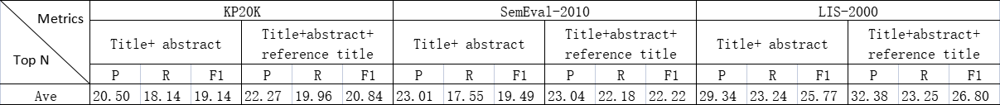

#  Enhancing Keyphrase Extraction from Academic Articles with their Reference Information

## Project Description
The research content of this project is to analyze the impact 
of the introduction of reference title in scientific literature 
on the effect of keyword extraction. This project uses three 
datasets: <b>SemEval-2010</b>, <b>KP20k</b> and <b>LIS-2000</b>, which are located 
in the dataset folder. At the same time, we use two unsupervised 
methods: <b>TF-IDF</b> and <b>TextRank</b>, and three supervised learning methods:
<b>NaiveBayes</b>, <b>CRF</b> and <b>BiLSTM-CRF</b>. The first four are traditional keywords 
extraction methods, located in the folder <b>ML</b>, and the last one is deep 
learning method, located in the folder <b>DL</b>.

## Reproduction results
In order to facilitate the reproduction of the experimental results, 
the project uses bat batch command to run the program uniformly 
(only in Windows Environment). The <b>dl.bat</b> file is the batch command 
to run the deep learning model, and the <b>ml.bat</b> file is the batch command 
to run the traditional algorithm.
### How does it work?
In the windows environment, use the key combination <b>Win + R</b> and enter <b>cmd</b>
to open the <b>DOS</b> command box, and switch to the project's root directory 
(Keyphrase_Extraction). Then input <b>dl.bat</b>, that is, run deep learning model 
to get the result of keyword extraction; Enter <b>ml.bat</b> to run traditional 
algorithm to get keywords Extract the results.

## Experimental results
The following figure is the results of running with BiLSTM-CRF.

## Dependency packages
Before running this project, check that the following Python packages are 
included in your runtime environment.

pytorch=1.7.1

nltk=3.5

numpy=1.19.2

pandas=1.1.3

tqdm=4.50.2

## Reference
Chengzhi Zhang, Lei Zhao, Mengyuan Zhao, Yingyi Zhang. Enhancing Keyphrase Extraction from Academic Articles with their Reference Information. 2020(Under Review) 
