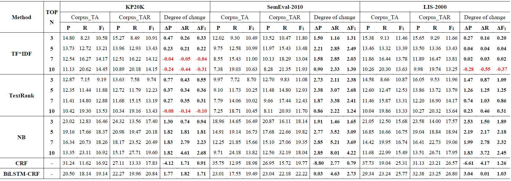

#  Enhancing Keyphrase Extraction from Academic Articles with their Reference Information

## Overview
<b>Dataset and code for paper "Enhancing Keyphrase Extraction from Academic Articles with their Reference Information".</b>

The research content of this project is to analyze the impact 
of the introduction of reference title in scientific literature 
on the effect of keyword extraction. This project uses three 
datasets: <b>SemEval-2010</b>, <b>KP20k</b> and <b>LIS-2000</b>, which are located 
in the dataset folder. At the same time, we use two unsupervised 
methods: <b>TF-IDF</b> and <b>TextRank</b>, and three supervised learning methods:
<b>NaiveBayes</b>, <b>CRF</b> and <b>BiLSTM-CRF</b>. The first four are traditional keywords 
extraction methods, located in the folder <b>ML</b>, and the last one is deep 
learning method, located in the folder <b>DL</b>.
### Directory structure
<pre>Keyphrase_Extraction:                 Root directory
│  dl.bat:                            Batch commands to run deep learning model
│  ml.bat:                            Batch commands to run traditional models
│ 
├─Dataset:                            Store experimental datasets
│      KP20k.json:                    Contains 2000 scientific papers 
│      SemEval-2010.json:             Contains 244 scientific papers
│      LIS-2000.json:                 Contains 2000 scientific papers
│ 
├─DL:                                 Store the source code of the deep learning model
│  │  build_path.py:                  Create file paths for saving preprocessed data
│  │  crf.py:                         Source code of CRF algorithm implementation(Use pytorch framework)
│  │  main.py:                        The main function of running the program
│  │  model.py:                       Source code of BiLSTM-CRF model
│  │  preprocess.py:                  Source code of preprocessing function
│  │  textrank.py:                    Source code of TextRank algorithm implementation.
│  │  tf_idf.py:                      Source code of TF-IDF algorithm implementation.
│  │  train.py:                       Source code for model training
│  │  utils.py:                       Some auxiliary functions
│  ├─configs:                         Parameter configuration of deep learning models
│  └─datas
│        tags:                        Label settings for sequence labeling
│ 
└─ML:                                 Store the source code of the traditional models
    │  build_path.py:                 Create file paths for saving preprocessed data
    │  configs.py:                    Path configuration file
    │  crf.py:                        Source code of CRF algorithm implementation(Use CRF++ Toolkit)
    │  evaluate.py:                   Source code for result evaluation
    │  naivebayes.py:                 Source code of naivebayes algorithm implementation(Use KEA-3.0 Toolkit)
    │  preprocessing.py:              Source code of preprocessing function
    │  textrank.py:                   Source code of TextRank algorithm implementation
    │  tf_idf.py:                     Source code of TF-IDF algorithm implementation
    │  utils.py:                      Some auxiliary functions
    ├─CRF++:                          CRF++ Toolkit
    └─KEA-3.0:                        KEA-3.0 Toolkit
</pre>

## Dataset Description

<b>The dataset includes the following three json files:</b>
<li> KP20k.json：Contains 2000 scientific papers from Dataset KP20k (https://drive.google.com/open?id=1ZTQEGZSq06kzlPlOv4yGjbUpoDrNxebR).
<li> SemEval-2010.json: SemEval-2010 Task 5 dataset, it contains 244 scientific papers and can be visited at: https://semeval2.fbk.eu/semeval2.php?location=data 
<li> LIS-2000.json: Contains 2000 scientific papers from journals in Library and Information Science(LIS).

<b>Each line of the json file includes: </b>
<li>title: The title the paper.
<li>abstract: The abstract the paper.
<li>keywords: the keywords of the paper and these keywords were annotated manually.
<li>references: references list and only the title of each reference is provided.

## Reproduction results
In order to facilitate the reproduction of the experimental results, 
the project uses bat batch command to run the program uniformly 
(only in Windows Environment). The <b>dl.bat</b> file is the batch command 
to run the deep learning model, and the <b>ml.bat</b> file is the batch command 
to run the traditional algorithm.

### How does it work?
In the Windows environment, use the key combination <b>Win + R</b> and enter <b>cmd</b>
to open the <b>DOS</b> command box, and switch to the project's root directory 
(Keyphrase_Extraction). Then input <b>dl.bat</b>, that is, run deep learning model 
to get the result of keyword extraction; Enter <b>ml.bat</b> to run traditional 
algorithm to get keywords Extract the results.

## Experimental results
The following figure shows that influence of reference information on key phrase extraction results of TF*IDF,TextRank, NB, CRF and BiLSTM-CRF.

 <b>Note</b>: △P, △R, △F1 denotes: .....respectively.

## Dependency packages
Before running this project, check that the following Python packages are 
included in your runtime environment.

<li>pytorch 1.7.1

<li>nltk 3.5

<li>numpy 1.19.2

<li>pandas 1.1.3

<li>tqdm 4.50.2

## Citation
Please cite the following paper if you use this codes and dataset in your work.
    
Chengzhi Zhang, Lei Zhao, Mengyuan Zhao, Yingyi Zhang. Enhancing Keyphrase Extraction from Academic Articles with their Reference Information. 2021(Under Review) 
